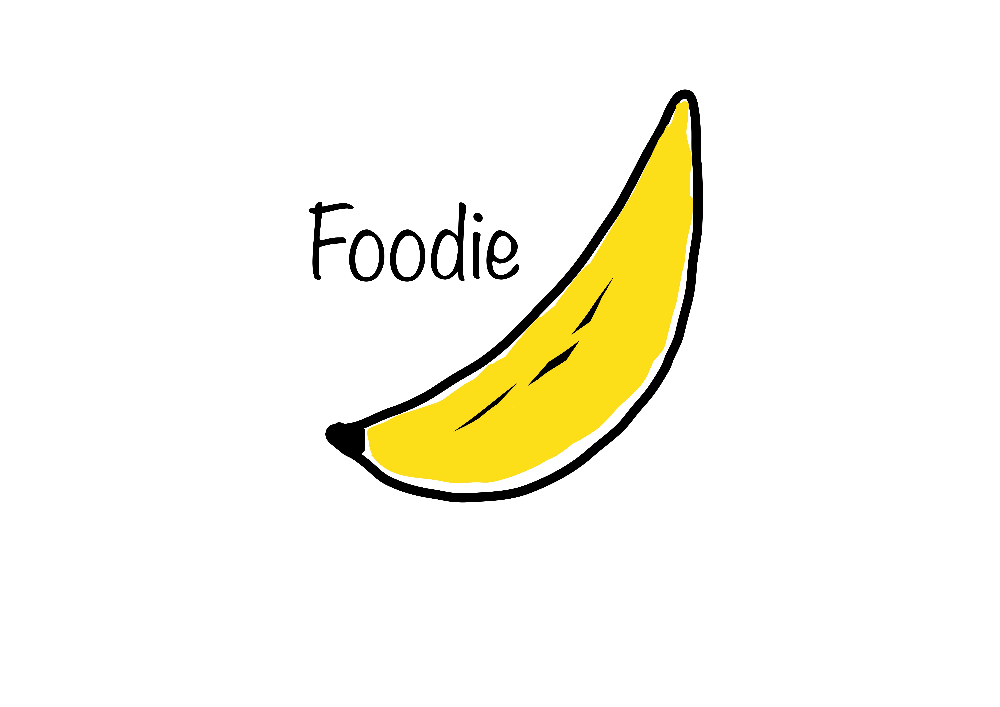
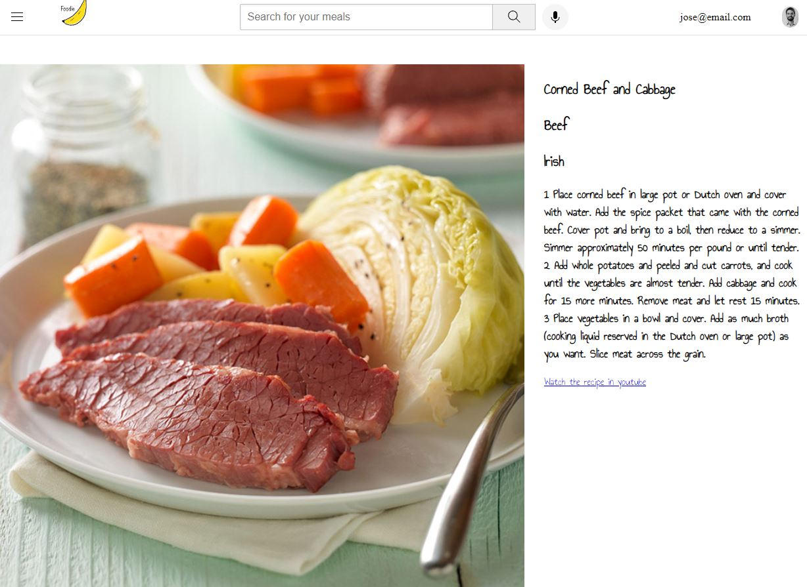

# Foodie

## Description

In this project I aim to create a small app that can give you information about how healthy you are eating.
It will offer you different options on what recipes to cook, what you have been eating in the past and how you can achieve
your nutrition goals.

It will then give you recommendation through statistical analytics.

This project has been mostly created as a showcase for Fastapi/Postresql.

## Modules and Languages

Backend: Postgresql, Python -- SQLalchemy, fastapi , pydantic  

Frontend: HTML, CSS, JavaScript, Python -- Flask  

Deployed on Ubuntu machine at DigitalOcean, with NGINX and Gunicorn  

## Back End
The main purpose of this project was to build a CRUD app as an API. The main contents of the database are amount of calories consumed when inserting an ingredient and a quantity.

You can create and delete new users.
To access the contents of the API you need to register an user and retrieve a JWT (Json Web Token).
Once credentials are verified you can GET information on your previous meals, and Post new meals.
The type of content accepted is structured using Models and Schemas, the project uses Typehints extensively.

# Stack
Python: Fastapi, SQLalchemy, pydantic
Server: Uvicorn
Database: SQL

## Front End
Built with Flask, the idea is to create a simple front end to visualize the results of the back end.
  

Combines some javascript, html and CSS.
Main Screen with summary of previous meals
  

Random recipe suggestions:  
  

## Roadmap

- [x] CRUD for Meals

- [x] JWT authentication enabled

- [x] Full Backend API deployed

- [x] Minimum Viable frontend

- [x] Deployed in ubuntu machine

- [ ] Improved Design for Frontend

- [ ] Containarize

- [ ] Computer Vision camera module

- [ ] Analytics

## License

The rights to this project are owned by Jose Sabater

## Authors and acknowledgment
José María Sabater
